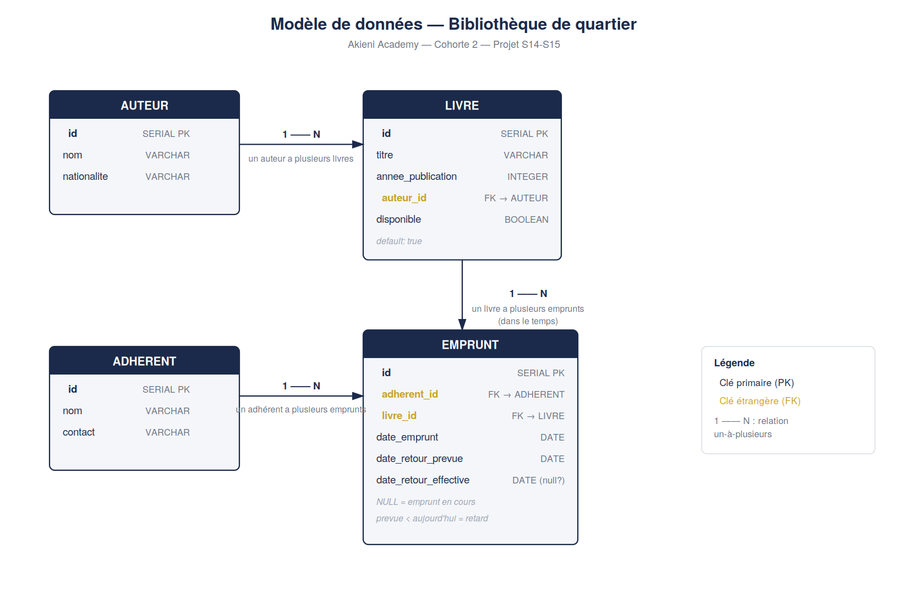

# Bibliothèque de quartier

Application complète de gestion d'une bibliothèque de quartier : auteurs, livres, adhérents et emprunts — backend, frontend et base de données.
Projet réalisé dans le cadre du Module 3 (Backend Node.js, SQL & Express) — Akieni Academy, Cohorte 2, Semaines 14-15.

## Stack technique

- **Backend** : Node.js / Express, PostgreSQL (via le driver `pg`)
- **Frontend** : HTML / CSS / JavaScript natif (une seule page, navigation gérée en JS, sans framework)
- Architecture backend en couches : routes → controllers → models

## Diagramme entité-relation



## Structure du dépôt

```
LIVRABLE_14_15/
├── backend/
│   ├── src/
│   │   ├── config/db.js         # connexion PostgreSQL (pool)
│   │   ├── routes/               # définition des endpoints
│   │   ├── controllers/           # logique métier
│   │   ├── models/                # requêtes SQL isolées
│   │   ├── middlewares/            # logger, validation, gestion d'erreurs
│   │   └── app.js                 # configuration Express + CORS
│   ├── schema.sql                 # script de création des tables + données de test
│   ├── server.js                  # point d'entrée
│   └── .env.example
└── frontend/
    ├── index.html                 # structure de toutes les sections (SPA simple)
    ├── css/style.css               # design system
    └── js/
        ├── api.js                  # toutes les fonctions fetch() vers l'API
        ├── navigation.js            # bascule entre sections
        ├── livres.js                 # liste, recherche, pagination, formulaire
        ├── auteurs.js                 # liste + formulaire
        ├── adherents.js                # liste + formulaire
        ├── emprunts.js                  # création, emprunts en cours/en retard, retour
        └── statistiques.js               # tableau de bord
```

## Installation — Backend

### Prérequis

- Node.js (v18 ou plus récent recommandé)
- PostgreSQL installé et démarré (via Postgres.app, Homebrew, ou autre)

### Étapes

1. Se placer dans le dossier backend :
   ```
   cd backend
   ```

2. Installer les dépendances :
   ```
   npm install
   ```

3. Créer la base de données PostgreSQL :
   ```
   createdb bibliotheque
   ```

4. Exécuter le script SQL pour créer les tables (et insérer quelques données de test) :
   ```
   psql -d bibliotheque -f schema.sql
   ```

5. Copier le fichier d'environnement et le remplir avec vos identifiants PostgreSQL :
   ```
   cp .env.example .env
   ```
   Puis éditer `.env` : `PGUSER`, `PGPASSWORD`, etc.

6. Démarrer le serveur :
   ```
   npm run dev
   ```
   L'API est alors accessible sur `http://localhost:3000`.

## Installation — Frontend

Le frontend est un site statique (HTML/CSS/JS) qui consomme l'API via `fetch()`. Il doit être servi par un serveur local — l'ouvrir directement en double-cliquant (`file://`) peut bloquer les requêtes vers l'API selon le navigateur.

1. Dans VS Code, installer l'extension **Live Server** (par Ritwick Dey) si ce n'est pas déjà fait.
2. Clic droit sur `frontend/index.html` → **Open with Live Server**.
3. Le site s'ouvre automatiquement (ex. `http://127.0.0.1:5500/frontend/index.html`).
4. Le backend doit être démarré au préalable (`npm run dev` dans `backend/`), sinon les listes afficheront un message d'erreur de connexion.

## Routes de l'API

| Méthode | Route | Description |
|---|---|---|
| GET | `/api/auteurs` | Liste des auteurs |
| POST | `/api/auteurs` | Créer un auteur |
| GET | `/api/adherents` | Liste des adhérents |
| POST | `/api/adherents` | Créer un adhérent |
| GET | `/api/adherents/:id/emprunts` | Historique des emprunts d'un adhérent |
| GET | `/api/livres?recherche=&page=&limite=` | Liste des livres, avec recherche et pagination |
| POST | `/api/livres` | Créer un livre |
| POST | `/api/emprunts` | Créer un emprunt (refuse si le livre est indisponible — 409) |
| PATCH | `/api/emprunts/:id/retour` | Marquer le retour d'un livre |
| GET | `/api/emprunts/en-cours` | Emprunts en cours |
| GET | `/api/emprunts/en-retard` | Emprunts en retard |
| GET | `/api/statistiques` | Tableau de bord (totaux, livre le plus emprunté, adhérent le plus actif) |

Une collection Postman complète (`Bibliotheque_API.postman_collection.json`) est disponible pour tester toutes les routes indépendamment du frontend.

## Fonctionnalités du frontend

- **Livres** : catalogue avec statut de disponibilité, recherche par titre/auteur, pagination, formulaire d'ajout
- **Auteurs** : liste et formulaire d'ajout
- **Adhérents** : liste et formulaire d'ajout
- **Emprunts** : formulaire de création (ne propose que les livres disponibles), liste des emprunts en cours avec mise en évidence visuelle des retards (couleur distincte), action "Marquer le retour"
- **Tableau de bord** : statistiques globales, actualisées à chaque ouverture de l'onglet
- Les erreurs renvoyées par le backend (validation, conflit sur un livre déjà emprunté, etc.) s'affichent directement dans les formulaires, avec le message exact du serveur

## Choix de modélisation

- **`disponible` sur `livre` est dénormalisé volontairement** : plutôt que de recalculer la disponibilité d'un livre à chaque requête en interrogeant la table `emprunt`, on la stocke directement comme un booléen sur `livre`. Ce choix simplifie beaucoup les listes et la recherche de livres (pas de sous-requête nécessaire), au prix de devoir synchroniser rigoureusement ce champ à chaque création ou retour d'emprunt — ce qui est fait dans le controller `emprunts.controller.js`.

- **`date_retour_effective` nullable sur `emprunt`** sert de marqueur d'état : `NULL` signifie que l'emprunt est toujours en cours. Un emprunt est considéré en retard lorsque `date_retour_effective IS NULL` et que `date_retour_prevue` est antérieure à la date du jour. Cette approche évite d'ajouter un champ `statut` texte supplémentaire qu'il faudrait aussi maintenir à jour manuellement.

- **Contraintes `ON DELETE RESTRICT`** sur les clés étrangères (`livre.auteur_id`, `emprunt.adherent_id`, `emprunt.livre_id`) : elles empêchent de supprimer un auteur, un adhérent ou un livre qui a encore des données liées, afin de préserver l'intégrité de l'historique des emprunts.

- **CORS activé côté backend** (`app.use(cors())`) : nécessaire car le frontend est servi sur un port différent (ex. `:5500` via Live Server) de celui de l'API (`:3000`) — sans ça, le navigateur bloquerait toutes les requêtes `fetch()` par sécurité.

- **Frontend en SPA simple, sans framework** : une seule page HTML, où le JavaScript affiche ou masque des sections au clic sur la navigation, sans rechargement. Chaque fichier JS a une responsabilité unique (une section = un fichier), suivant le même principe de séparation que l'architecture backend.
